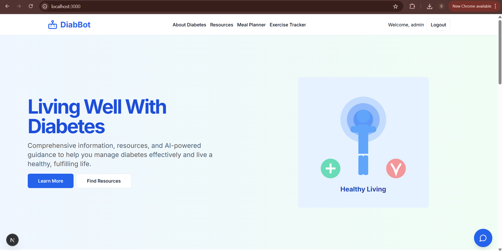
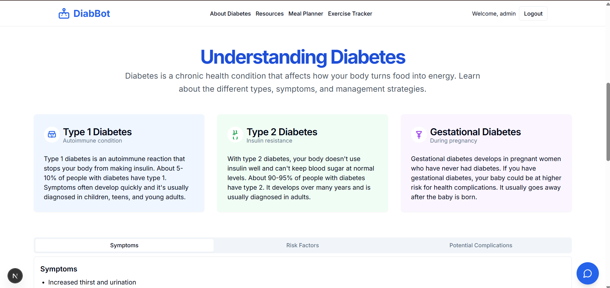
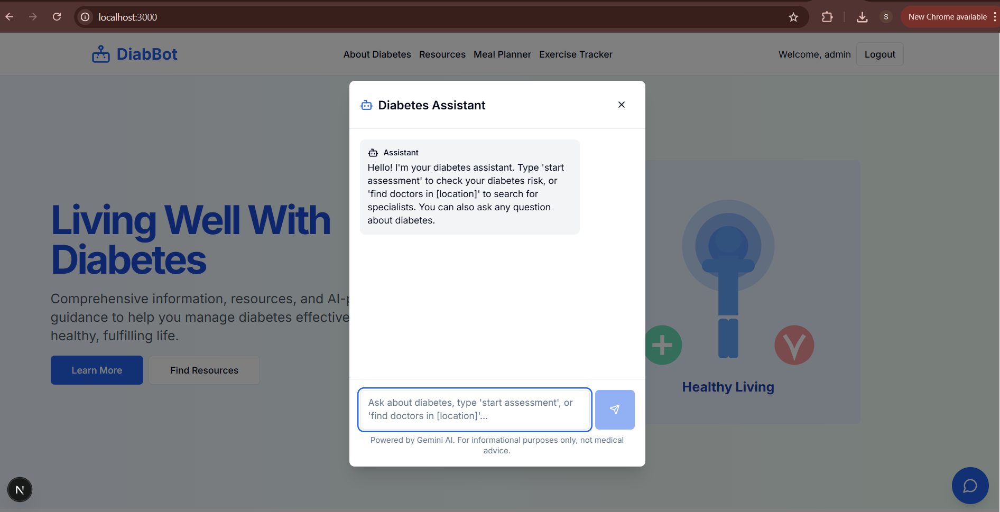
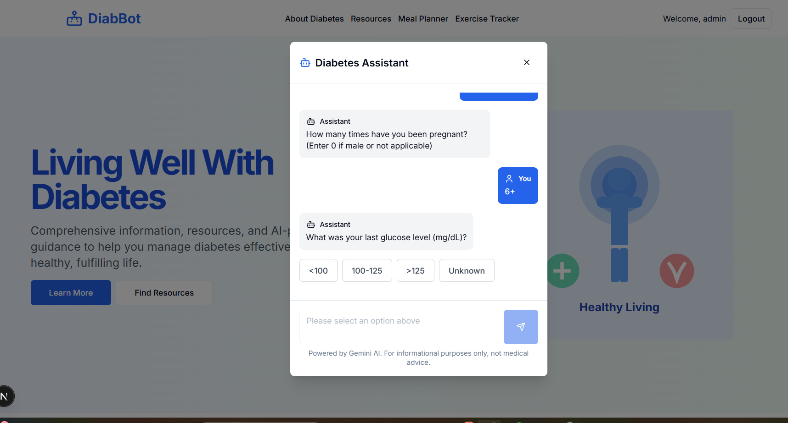
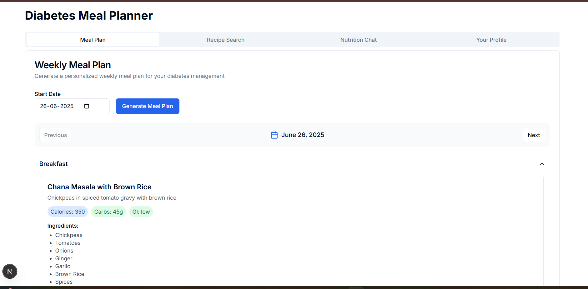
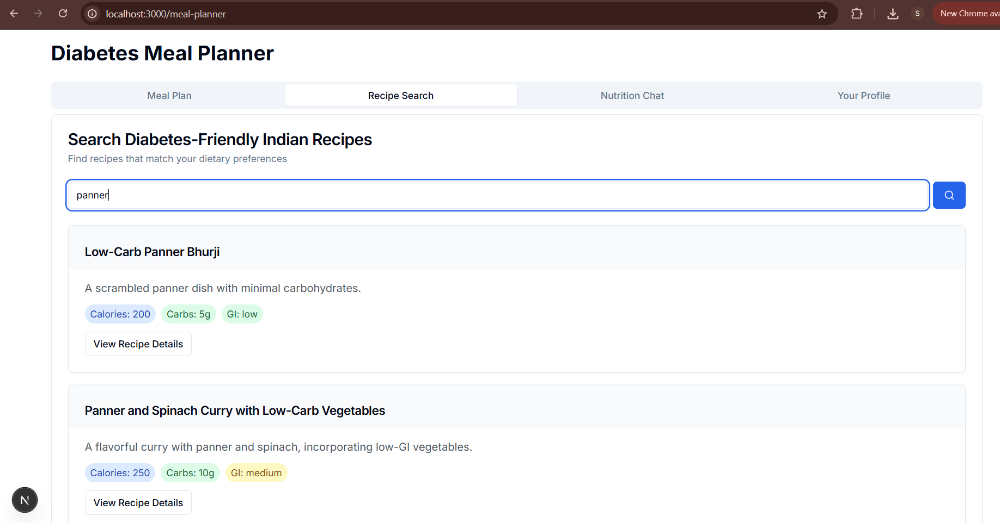
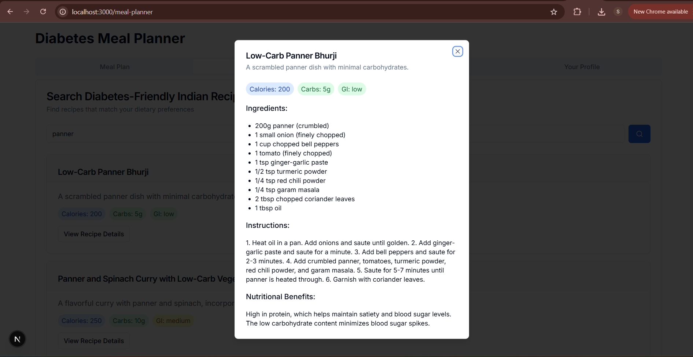
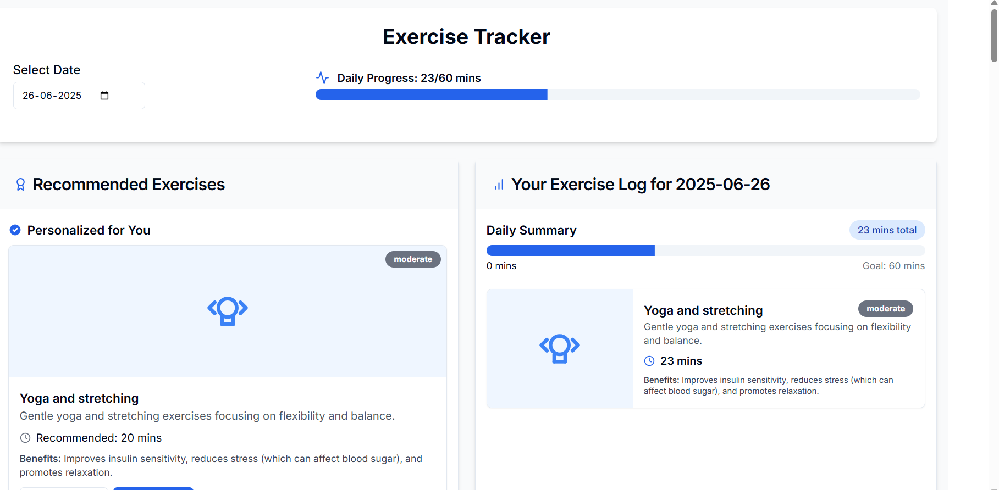

# Diabetes Assistant Chatbot

## Overview

The **Diabetes Assistant Chatbot** is a web-based application designed to empower users in managing diabetes through risk assessment, personalized meal planning, recipe search, and access to nearby specialists. Developed by **Soumin Mujumdar** and **Vidhi Binwal**, students at SIT Pune, the project leverages **Next.js** (frontend) and **Flask** (backend), integrating the **Gemini AI API** for conversational responses and the **Google Maps API** for location-based doctor searches. The application offers a responsive, user-friendly interface, enabling users to assess diabetes risk, receive tailored Indian meal plans, explore diabetes-friendly recipes, and locate specialists. Users can download **PDF reports** summarizing health insights, making it a comprehensive health-tech solution.

## Screenshots

Below are screenshots showcasing key features of the Diabetes Assistant Chatbot:







*Chatbot interface for initiating risk assessments and asking diabetes-related questions.*





*7-day meal plan displaying diabetes-friendly Indian recipes.*


*Daily Exercise tracker diplaying personalized exercises for users*


## Features

### 1. Interactive Diabetes Risk Assessment

- **Functionality**: Users initiate a risk assessment by typing "start assessment" in the chatbot or entering health data (e.g., pregnancies, glucose, blood pressure, BMI, age). A **Random Forest Classifier**, trained on the Pima Indians Diabetes dataset, predicts risk levels.
- **Process**: The model processes inputs, delivering a risk score (0 or 1), probability, and a risk level (Low: <0.3, Moderate: <0.7, High: ≥0.7).
- **Output**: Provides personalized lifestyle recommendations (e.g., diet, exercise) to mitigate risk.
- **Purpose**: Equips users with data-driven insights for proactive diabetes management.

### 2. Real-Time Doctor Search

- **Functionality**: Users search for specialists by typing "find doctors in [location]" in the chatbot, using the **Google Maps API** to fetch nearby endocrinologists.
- **Features**:
  - Displays doctor details (name, address, contact, ratings) with Google Maps links for directions.
  - Filters results by proximity and relevance.
- **Purpose**: Connects users with healthcare professionals for consultations.

### 3. AI-Powered Education

- **Functionality**: The **Gemini AI API** powers a chatbot that delivers culturally relevant responses on diabetes management, nutrition, and lifestyle.
- **Capabilities**:
  - Answers queries on symptoms, low glycemic index (GI) foods, and meal timing, tailored to Indian cuisine.
  - Includes medical disclaimers, advising professional consultation.
- **Purpose**: Educates users with accurate, accessible information.

### 4. Personalized Meal Planning

- **Functionality**: Generates a 7-day meal plan based on user preferences (vegetarian, non-vegetarian, eggetarian, vegan) and health profile (e.g., allergies, diabetes type).
- **Process**: Users select a start date, and the backend curates daily meals (breakfast, lunch, dinner) from a dataset of diabetes-friendly Indian recipes (e.g., Chana Masala, Tandoori Chicken).
- **Output**: Meals include calories, carbs, glycemic index, ingredients, instructions, and nutritional benefits, displayed in an accordion interface.
- **Purpose**: Supports stable blood sugar levels through structured meal plans.

### 5. Recipe Search

- **Functionality**: Users search for diabetes-friendly Indian recipes by keywords (e.g., "dal", "paneer").
- **Process**: The backend filters local recipes and uses **Gemini AI** to generate additional recipes matching user constraints.
- **Output**: Recipes include calories, carbs, glycemic index, and diabetes-specific tips (e.g., portion control).
- **Purpose**: Helps users discover suitable recipes for dietary needs.

### 6. User Profile Management

- **Functionality**: Users input and update health data (age, gender, weight, height, activity level, diet type, allergies, diabetes type, blood sugar, medications).
- **Process**: Profile data is stored in memory to personalize meal plans, recipes, and chatbot responses.
- **Output**: A profile tab enables editing with input validation.
- **Purpose**: Ensures personalized recommendations respect user restrictions.

### 7. PDF Report Generation

- **Functionality**: Users download a **PDF report** summarizing risk assessment results, including risk score, probability, health metrics, and prevention strategies.
- **Implementation**: Uses **jsPDF** for client-side generation, with potential **ReportLab** backend support.
- **Purpose**: Provides a record for users or healthcare providers.

### 8. Responsive Design

- **Functionality**: A **Tailwind CSS**-based interface ensures usability across desktop, tablet, and mobile devices.
- **Features**:
  - Tabbed navigation for risk assessment, meal planning, recipe search, chatbot, and profile.
  - Interactive components (accordions, dialogs, toast notifications) and smooth scrolling.
- **Purpose**: Delivers a seamless user experience.

## Contributions

- **Soumin Mujumdar (22070122190)**:
  - Contributed to **frontend** development, implementing responsive UI with **Next.js**, **TypeScript**, **Tailwind CSS**, and **lucide-react**.
  - Developed **backend** logic with **Flask** and **Python**, including endpoints for risk assessment, meal planning, and recipe search.
  - Integrated **Gemini AI** and **Google Maps API**, handling JSON responses and CORS configurations.
  - Collaborated on **machine learning** pipeline using **pandas** and **scikit-learn** for diabetes risk prediction.
  - Debugged issues like TypeScript errors, PDF buffer issues, and API retry logic, ensuring robust functionality.

- **Vidhi Binwal (22070122249)**:
  - Contributed to **frontend** development, designing interactive components with **Next.js**, **TypeScript**, and **Tailwind CSS**, and implementing **jsPDF** for PDF reports.
  - Developed **backend** logic with **Flask** and **Python**, supporting endpoints for user profiles, meal planning, and chatbot responses.
  - Integrated **Gemini AI** and **Google Maps API**, optimizing API calls and error handling.
  - Worked on **machine learning** model training with **pandas** and **scikit-learn** for accurate risk predictions.
  - Resolved issues like CORS errors, fetch request failures, and UI inconsistencies, demonstrating problem-solving skills.

## Technologies Used

### Frontend
- **Next.js**: Server-side rendering and static site generation.
- **TypeScript**: Type safety and maintainability.
- **Tailwind CSS**: Responsive UI development.
- **lucide-react**: Customizable icons.
- **jsPDF**: Client-side PDF generation.

### Backend
- **Flask**: Lightweight API framework.
- **Python**: Data processing and ML with **pandas**, **scikit-learn**, **google-generativeai**.

### APIs
- **Gemini AI API**: Conversational responses and recipe generation.
- **Google Maps API**: Location-based doctor searches.

## Technical Implementation

### Backend (Flask)
- **Endpoints**:
  - `/predict`: Diabetes risk assessment with **Random Forest**.
  - `/chatbot`: Conversational queries via **Gemini AI**.
  - `/doctors`: Specialist search with **Google Maps API**.
  - `/user/profile`: Profile management.
  - `/meal-plan/generate`: 7-day meal plans.
  - `/recipes/search`: Recipe search and generation.
  - `/user/meals`: User meal tracking.
  - `/user/summary`: Nutritional summaries.
- **Error Handling**: Retry logic for **Gemini AI**, **CORS** support, and logging.
- **Data Management**: In-memory storage for profiles and meals, with database potential.

### Frontend (Next.js)
- **Components**: Modular React components for chat, meals, recipes, and profiles.
- **State Management**: `useState`, `useEffect` for dynamic updates.
- **API Integration**: Fetch requests with toast notifications for errors.
- **UI Features**: Tabbed interface, accordions, dialogs, input validation.

### APIs Integration
- **Gemini AI**: JSON-formatted responses for chatbot and recipes.
- **Google Maps**: Parsed location data for doctor searches.

## Deployment Status
- **Prototype**: Fully functional in local environments (`http://localhost:3000` for frontend, `http://127.0.0.1:5000` for backend).
- **Future Deployment**: Planned for hosting on platforms like **Vercel** (frontend) and **Heroku** (backend) for public access.

## Setup Instructions

1. **Clone the Repository**:
   ```bash
   git clone <repository-url>
   cd diabetes-assistant-chatbot
   ```

2. **Install Dependencies**:
   - Frontend:
     ```bash
     cd frontend
     npm install
     ```
   - Backend:
     ```bash
     cd backend
     pip install -r requirements.txt
     ```

3. **Set Up Environment Variables**:
   - Create a `.env` file in the backend directory:
     ```plaintext
     GEMINI_API_KEY=your_gemini_api_key
     GOOGLE_MAPS_API_KEY=your_google_maps_api_key
     ```
   - Obtain API keys from **Google Cloud Console**.

4. **Run the Backend**:
   ```bash
   cd backend
   python app.py
   ```
   - Runs on `http://127.0.0.1:5000`.

5. **Run the Frontend**:
   ```bash
   cd frontend
   npm run dev
   ```
   - Runs on `http://localhost:3000`.

6. **Access the Application**:
   - Open `http://localhost:3000` to use the chatbot, assess risks, plan meals, search recipes, and find doctors.

## Usage Workflow

1. **Risk Assessment**:
   - Type "start assessment" or input health data in the profile tab.
   - Receive risk score, probability, and recommendations.
   - Download a **PDF report**.

2. **Doctor Search**:
   - Type "find doctors in [location]" to view specialists with details and map links.

3. **Meal Planning**:
   - Generate a 7-day meal plan tailored to diet and health profile.
   - View daily meals with nutritional details.

4. **Recipe Search**:
   - Search recipes by keyword, filtering by diet and allergies.
   - View recipe details and diabetes-specific tips.

5. **Educational Queries**:
   - Ask about diabetes management or nutrition.
   - Receive personalized, culturally relevant responses.

6. **Profile Management**:
   - Update health and dietary preferences for personalized recommendations.

## Created By

- **Soumin Mujumdar** (22070122190)
- **Vidhi Binwal** (22070122249)
- **Institution**: Symbiosis Institute of Technology (SIT), Pune

## Future Enhancements

- **Exercise Recommendations**: Add personalized exercise plans for diabetes management.
- **Multilingual Support**: Include regional Indian languages for accessibility.
- **Health Metric Tracking**: Enable logging and tracking of blood sugar levels.
- **Database Integration**: Replace in-memory storage with a database for persistent data.


